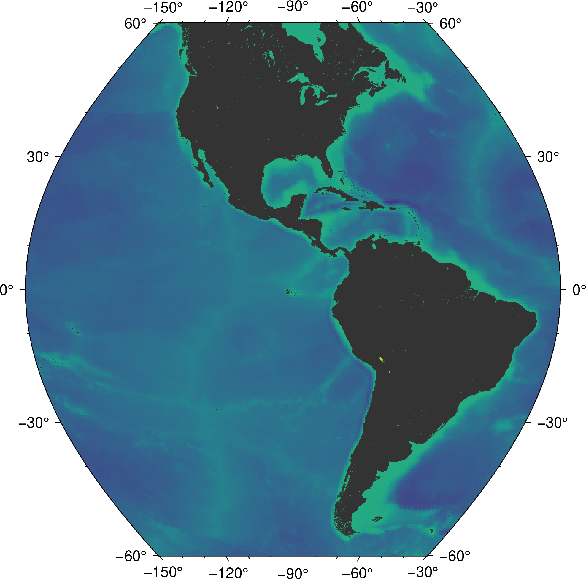

<!--
-------------------------------------------------------------------------------
This file defines the contents of each slide.
The reveal.js configuration can be found in index.html
-------------------------------------------------------------------------------
-->

<!-- .slide: class="slide-title" data-background-color="#262626" data-background-size="contain" -->

<!-- Place the content at the bottom of the slide -->
<div class="r-stretch">
</div>

<h1 id="talk-title">
  Estratégias de Ensinagem | 11 a 20
</h1>
<p id="talk-authors">
  <a>Yago M Castro</a>
</p>

<!-- Place location and date side-by-side with affiliation logos -->
<div class="row talk-info">
<div class="col-large">

<i class="fa fa-calendar-alt" style="margin: 0 10px 0 0"></i>
08 de Outubro de 2024
<span style="margin: 0 20px"></span>
Seminário  1 | Preparação Pedagógica

<!-- Permission to reuse and CC-BY license logo -->
<i class="fa fa-camera" style="margin: 0 10px 0 0"></i>
Sinta-se à vontade para tirar capturas de tela/compartilhar/reutilizar esta apresentação
<span style="margin: 0 20px"></span>
<a href="https://creativecommons.org/licenses/by/4.0/"><i class="fab fa-creative-commons"></i><i class="fab fa-creative-commons-by" style="margin: 0 10px 0 2px"></i>CC-BY 4.0 License</a>

</div>
<div class="col-medium">

<!-- Add logos here. Need these wrappers to align them to the bottom right -->
<div class="talk-logos-container">
<div class="talk-logos">
  <a href="https://www.compgeolab.org"></a>
  <a href="https://www.iag.usp.br/"></a>
  <a href="https://www.usp.br/"></a>
</div>
</div>

</div>
</div>

===============================================================================

<!-- .slide: data-background-color="#262626" data-background-size="contain" -->

<h1>Estratégias de ensinagem</h1>

<div class="row">
  <div class="col">
    <ul class="fa-ul">
      <li> Dramatização</li>
      <li> Seminário</li>
      <li> Estudo de Caso</li>
      <li> Painel</li>
      <li> Simpósio</li>
    </ul>
  </div>
  <div class="col">
    <ul class="fa-ul">
      <li> Juri Simulado</li>
      <li> Fórum</li>
      <li> Oficina (laboratório ou workshop)</li>
      <li> Estudo do Meio</li>
      <li> Ensino com pesquisa</li>
    </ul>
  </div>
</div>

===============================================================================

<!-- .slide: data-background-color="#262626" data-background-size="contain" -->

<h1>Estratégias de ensinagem</h1>

<div class="row">
  <div class="col">
    <ul class="fa-ul">
      <li> Dramatização</li>
      <li style="color:red"> Seminário</li>
      <li> Estudo de Caso</li>
      <li> Painel</li>
      <li style="color:red"> Simpósio</li>
    </ul>
  </div>
  <div class="col">
    <ul class="fa-ul">
      <li> Juri Simulado</li>
      <li> Fórum</li>
      <li style="color:red"> Oficina (laboratório ou workshop)</li>
      <li> Estudo do Meio</li>
      <li style="color:red"> Ensino com pesquisa</li>
    </ul>
  </div>
</div>

===============================================================================
<!-- .slide: data-background-color="#262626" data-background-size="contain" -->

# Seminário

<ul>
  <li class="text-left fragment"><b>Descrição: </b>É um espaço em que as ideias devem permear ou ser semeadas. Portanto, é um espaço onde um grupo discute ou debate temas ou problemas que são colocados em discussão.
</li>
  
  <li class="text-left fragment"><b>Operações de pensamento: </b> Análise / Interpretação / Crítica / Levantamento de hipóteses / Busca de suposições / Obtenção e organização de dados / Comparação / Aplicação de fatos a novas situações</li>

</ul>

===============================================================================
<!-- .slide: data-background-color="#262626" data-background-size="contain" -->

# Seminário

<ul>
  <li class="text-left fragment"><b>Dinâmica da atividade:</li>
  <ul>
    <li class="text-left fragment"><b>Preparação</b></li>
    <ul>
      <li class="text-left fragment">Apresentar o tema, justificar sua importância, desafiar os estudantes e orientar as pesquisas (bibliográfica, de campo ou laboratório)</li>
      <li class="text-left fragment">Organizar o calendário para as apresentações dos estudantes</li>
      <li class="text-left fragment">Orientar os estudantes na pesquisa e na elaboração dos registros para apresentação ao grupo</li>
      <li class="text-left fragment">Organizar o espaço físico para facilitar o diálogo entre os participantes.</li>
  </ul>
</ul>

===============================================================================
<!-- .slide: data-background-color="#262626" data-background-size="contain" -->

# Seminário

<ul>
  <li class="text-left"><b>Dinâmica da atividade:</li>
  <ul>
    <li class="text-left fragment"><b>Desenvolvimento</b></li>
    <ul>
      <li class="text-left fragment">O secretário anota problemas, soluções e conclusões durante a discussão</li>
      <li class="text-left fragment">O professor dirige a sessão de crítica ao final</li>
      <li class="text-left fragment">O professor comenta cada trabalho e sua apresentação</li>
      <li class="text-left fragment">O professor organiza uma síntese do que foi apresentado</li>
  </ul>
    <li class="text-left fragment"><b>Relatório:</b > resumo escrito, produzido individualmente ou em grupo</li>
</ul>

===============================================================================
<!-- .slide: data-background-color="#262626" data-background-size="contain" -->

# Seminário

<ul>
  <li class="text-left fragment"><b>Avaliação: </b>Os critérios de avaliação devem ser adequados aos objetivos da atividade em termos de conhecimento, habilidades e competências</li>
</ul>

===============================================================================
<!-- .slide: data-background-color="#262626" data-background-size="contain" -->

# Ensino com pesquisa

<ul>
  <li class="text-left fragment"><b>Descrição: </b>É a união dos princípios de ensino e pesquisa, onde a dúvida e a crítica são centrais. O estudo é visto como construtivo e significativo, promovendo concentração, autonomia e um equilíbrio entre reprodução e análise
</li>
  
  <li class="text-left fragment"><b>Operações de pensamento: </b>Observação / Interpretação / Classificação / Crítica / Resumo / Análise / Hipóteses e busca de suposições / Decisão / Comparação / Imaginação / Planejamento / Obtenção e organização de dados / Aplicação de fatos a novas situações</li>

</ul>

===============================================================================
<!-- .slide: data-background-color="#262626" data-background-size="contain" -->

# Ensino com pesquisa

<ul>
  <li class="text-left"><b>Dinâmica da atividade:</li>
  <ul>
    <li class="text-left fragment"><b>Desafiar o estudante como investigador</b></li>
    <li class="text-left fragment"><b>Estabelecer princípios: evolução do conhecimento, solução de problemas, critérios de validação, reprodução e análise</b></li>
    <li class="text-left fragment"><b>Relatório:</b > resumo escrito, produzido individualmente ou em grupo</li>
</ul>

===============================================================================
<!-- .slide: data-background-color="#262626" data-background-size="contain" -->

# Ensino com pesquisa

<ul>
  <li class="text-left"><b>Dinâmica da atividade:</li>
  <ul>
    <li class="text-left"><b>Construção do projeto:</b></li>
    <ul>
      <li class="text-left fragment">Definir o problema de pesquisa</li>
      <li class="text-left fragment">Definir dados e procedimentos de investigação</li>
      <li class="text-left fragment">Definir a análise dos dados</li>
      <li class="text-left fragment">Interpretar/validar as suposições</li>
      <li class="text-left fragment">Apresentar os resultados</li>
      <li class="text-left fragment">Fazer recomendações</li>
  </ul>
</ul>

===============================================================================
<!-- .slide: data-background-color="#262626" data-background-size="contain" -->

# Ensino com pesquisa

<ul>
  <li class="text-left"><b>Avaliação:</li>
    <ul>
      <li class="text-left fragment">O acompanhamento deve ser contínuo, com feedback das fases já vivenciadas</li>
      <li class="text-left fragment">Hipóteses incompletas e dados irrelevantes devem ser substituídos por mais adequados.</li>
      <li class="text-left fragment">Um cronograma de fases auxilia no autocontrole do estudante ou grupo</li>
      <li class="text-left fragment">Os critérios de avaliação devem ser estabelecidos antecipadamente e podem ser ajustados durante o processo</li>
</ul>

===============================================================================

<h2> Definição e Objetivos</h2>0
<ul>
  <li class="text-left fragment"><b>Desenvolvimento de empatia:</b> Estudantes assumem papéis imaginários</li>
  
  <li class="text-left fragment"><b>Aproximação da realidade social:</b> Traz vivências reais para serem analisadas em sala de aula</li>
  
  <li class="text-left fragment"><b>Fomento à criatividade e liberdade de expressão:</b> Incentiva a desinibição e expressão dos estudantes</li>
</ul>

===============================================================================
<h2>Aplicações no Processo de Ensino</h2>
<ul>
  <li class="text-left fragment"><b>Mobilização:</b> Incentiva a imersão em problemas reais</li>
  <li class="text-left fragment"><b>Síntese:</b> Avalia o entendimento e progresso na análise de uma problemática</li>
</ul>

===============================================================================
<h2>Benefícios chave</h2>
<ul>
  <li class="text-left fragment">Desenvolvimento de <b>habilidades sociais</b></li>
  <li class="text-left fragment">Incentivo ao pensamento crítico e análise coletiva</li>
  <li class="text-left fragment">Envolvimento ativo dos estudantes no processo de aprendizagem</li>
</ul>

===============================================================================
<div class="r-stretch">

# Some facts

About a certain topic.

</div>
<div class="footnote">

This is a little footnote.
Use it to add notes, citations, [links](https://www.leouieda.com/), etc.
<br>
Notice how the `div` above uses `r-stretch` to push this note to the bottom.

</div>

===============================================================================

<div class="r-stretch centered">
<div>

# Even more facts!

About many different things.

</div>
</div>
<div class="footnote-left">

Left aligned footnote.
Use `centered` on the `div` above to vertically center content.
<br>
Need to put another `div` inside of it as well.

</div>

===============================================================================

<!-- .slide: data-background-image="assets/agu2019.svg" data-background-size="contain" data-background-color="#000000" -->

<div class="r-stretch">
</div>
<div class="footnote-center dark">

Centered footnote with a dark background on a slide with a background.
<br>
Set the size to `contain` to make sure aspect ratios are preserved and the
background isn't cropped.
<br>
It's a good idea to add alt-text to this footnote if the background is
important.

</div>

===============================================================================

<!-- .slide: data-background-video="assets/brasil-sao-paulo-rio.mp4" data-background-size="contain" data-background-color="#000000" -->

<div class="r-stretch">
</div>
<div class="footnote">

This is how you use a video background.
The video auto starts when flipping to this slide.

</div>

===============================================================================

<!-- .slide: class="slide-transition" -->

# A transition slide <br> with a large title

...and some text.

===============================================================================

# Maths

This is an inline $\int_a^b x^2 dx$ and $\delta g = g - \gamma$:

`\[ \int_a^b x^2 dx \]`

===============================================================================

<!-- .slide: data-background-image="assets/agu2019.svg" data-background-size="contain" data-background-opacity="0.3" data-background-color="#000000" -->

<div class="quote">

Big quote message with a faded background image.
Bla bla bla bla bla bla bla bla bla bla bla bla bla bla bla.

</div>

===============================================================================

<!-- .slide: data-background-image="assets/agu2019.svg" data-background-size="contain" data-background-opacity="0.3" data-background-color="#ffffff" -->

<div class="quote dark">

Light fade of the background with a dark quote.

</div>

===============================================================================

# Two column layout

<div class="row">
<div class="col">

## Theory

Explain something here.
This is how you make a FontAwesome list:

<ul class="fa-ul">

<li>
<span class="fa-li"> <i class="fa fa-lightbulb fa-fw"></i> </span>
Make a list with
</li>

<li>
<span class="fa-li"> <i class="fa fa-file-alt fa-fw"></i> </span>
some awesome icons
</li>

<li>
<span class="fa-li"> <i class="fa fa-users fa-fw"></i> </span>
instead of bullet points
</li>

</ul>

</div>
<div class="col tiny">


Some text explaining the figure.
Maybe even a bit of maths like $\gamma$.

</div>
</div>

<div class="footnote">

Good place for a citation or image credit.
This one is by Leonardo Uieda (CC-BY).

</div>

===============================================================================

<div class="r-stretch centered">
<div>

# Multiple columns

Place as many `col`s as you want. They will have the same size.

<div class="row">
<div class="col">

Bla bla bla bla bla bla bla bla bla bla bla bla bla bla bla bla bla bla bla bla
bla bla.

</div>
<div class="col tiny">


Bla bla bla bla bla bla bla bla bla bla bla bla bla bla bla bla bla bla bla bla
bla bla.

</div>
<div class="col tiny">


Bla bla bla bla bla bla bla bla bla bla bla bla bla bla bla bla bla bla bla bla
bla bla.

</div>
</div>

</div>
</div>
<div class="footnote">

Images by Leonardo Uieda (CC-BY).

</div>

===============================================================================

# This one has columns of different size

<div class="row">
<div class="col-large tiny">


This way the image is larger on the screen. Use it for maps or main figures.

</div>
<div class="col small">

Explain what is shown on the image.
Use the `small` class to adjust font size.

Maybe include some maths:

$ D\dfrac{\partial^4 w}{\partial x^4} = q - g (\rho_m - \rho_w) w $

</div>
</div>

===============================================================================

<div class="row">
<div class="col tiny">


This way the image is narrow so it should be in a smaller column.

</div>
<div class="col-medium">

# Column sizes

Columns come in 3 sizes:

1. `col`
1. `col-medium`
1. `col-large`

These are more proportions than fixed sizes.

</div>
</div>

===============================================================================

# Code

Example of using PyGMT to make a map:

<div class="row">
<div class="col-large fragment small">

This code:

```python
import pygmt

# Load built-in topography data
grid = pygmt.datasets.load_earth_relief()

fig = pygmt.Figure()
# Pseudo-color map of topography
fig.basemap(
    region=[-150, -30, -60, 60],
    projection="I-90/6i",
    frame=True,
)
fig.grdimage(grid=grid, cmap="viridis")
# Mask continents in dark grey
fig.coast(land="#333333")
# Display in Jupyter or pop-up window
fig.show()
```
</div>
<div class="col-medium fragment small">

Makes this map 👇



</div>

===============================================================================

<!-- .slide: class="slide-contact" data-background-image="assets/contact-slide.svg" data-background-size="contain" data-background-color="#000000" -->

<div class="r-stretch centered">
<div>

<i class="fas fa-comments"></i>
<br>
Contact:
<a href="https://www.leouieda.com">www.leouieda.com</a>

<i class="fab fa-github"></i>
<br>
Source code for this presentation:
<br>
[github.com/leouieda/talk-template](https://github.com/leouieda/talk-template)

<i class="fab fa-creative-commons"></i><i class="fab fa-creative-commons-by"></i>
<br>
Unless otherwise noted,
the contents of this presentation are
licensed under the
<br>
[Creative Commons Attribution 4.0 International License](https://creativecommons.org/licenses/by/4.0/).

</div>
</div>
<div class="footnote-left dark">

The background image is a Landsat 9 scene of the city of São Paulo, Brazil,
showing the USP campus in the center.

</div>
